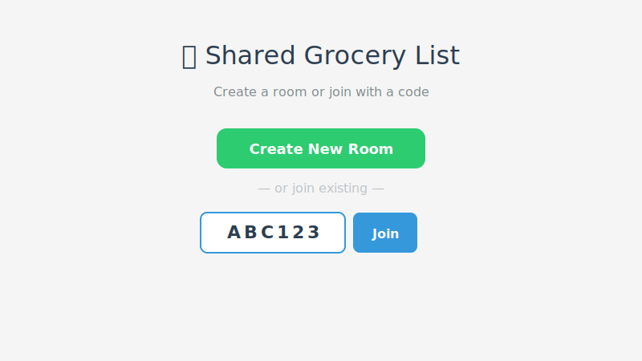
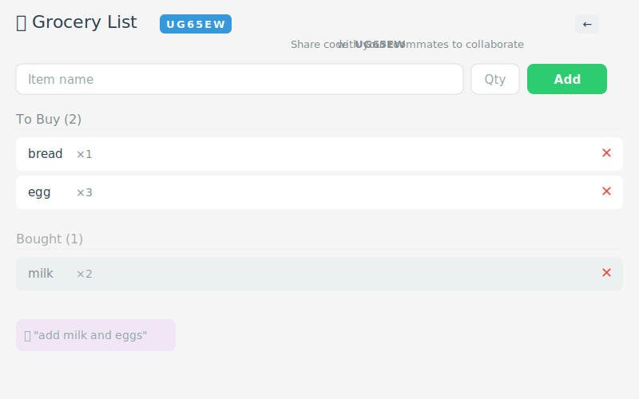

# Shared Grocery List

A web app for shared grocery list management with AI-powered natural language input. Built for the SE Toolkit Hackathon.

## Demo

### Landing — Create or Join Room


### Shared Grocery List


*Replace placeholder screenshots with real screenshots after deploying.*

## Context

### End Users
Roommates, couples, and families who share grocery shopping responsibilities.

### Problem
It's unclear what items have run out at home — someone forgot to buy milk, someone bought bread twice. No shared visibility leads to waste and frustration.

### Solution
A simple shared grocery list accessible from any device. Create a room, share the 6-character code with roommates, and everyone can add items manually or via natural language ("add milk and eggs"), mark items as bought, and see the same real-time list.

## Features

### Implemented
- ✅ Shared rooms with 6-character codes
- ✅ Add/remove grocery items
- ✅ Mark items as "bought"
- ✅ Auto-refresh every 3 seconds for shared sync
- ✅ Natural language input via AI agent (nanobot)
- ✅ Room isolation — items only visible within the same room
- ✅ Mobile-responsive UI
- ✅ Dockerized deployment

### Planned
- ⬜ Multiple lists per user (home/work)
- ⬜ Item categories with filtering
- ⬜ Purchase history
- ⬜ User authentication

## Usage

1. **Open the app** in your browser
2. **Create a room** or **join** with an existing code
3. **Share the code** with your roommates
4. **Add items** manually or via the "🤖 AI Add" button:
   - `"add milk and eggs"`
   - `"twenty one chupa chups"`
   - `"3x milk, bread, butter"`
5. **Tap items** to mark as bought
6. Everyone sees changes within 3 seconds

## Deployment

### Requirements
- Ubuntu 24.04 (or any Linux with Docker)
- Docker and Docker Compose installed

### Step-by-Step

1. **Clone the repository:**
   ```bash
   git clone https://github.com/flikspy/se-toolkit-hackathon.git
   cd se-toolkit-hackathon
   ```

2. **Build and start all services:**
   ```bash
   docker compose up -d --build
   ```

3. **Access the app:**
   - Frontend: `http://<vm-ip>:3000`
   - Backend API: port 8000 (internal only, via nginx proxy)
   - API Docs: `http://<vm-ip>:3000/api/docs` (proxied)

### Architecture

```
Client (Browser) → Nginx (port 3000)
                        ├─ serves React SPA
                        ├─ proxies /rooms/*     → Backend
                        ├─ proxies /agent/*     → Backend
                        └─ proxies /health      → Backend
                                       ↓
                              Backend (FastAPI, port 8000)
                                       ↓
                              PostgreSQL (port 5432)
```

### Services
| Service | Port | Description |
|---------|------|-------------|
| Frontend (React + Nginx) | 3000 | Web UI + API proxy |
| Backend (FastAPI) | internal | REST API + Agent |
| Database (PostgreSQL) | internal | Persistent storage |

### Local Development

**Backend (SQLite):**
```bash
cd backend
python3 -m venv .venv && source .venv/bin/activate
pip install -r requirements.txt
uvicorn main:app --reload
```

**Frontend:**
```bash
cd client-web-react
npm install
REACT_APP_API_URL=http://localhost:8000 npm start
```

**Tests:**
```bash
cd backend
pip install pytest httpx
pytest test_main.py -v
```
